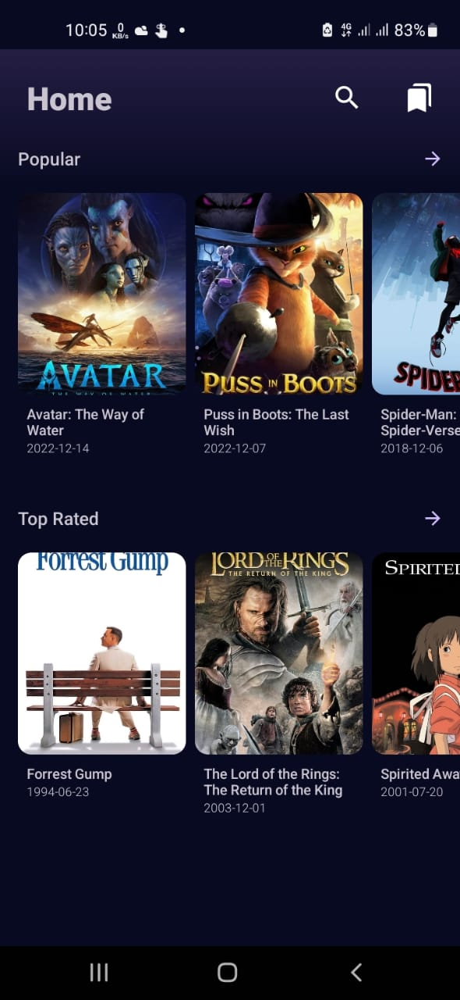
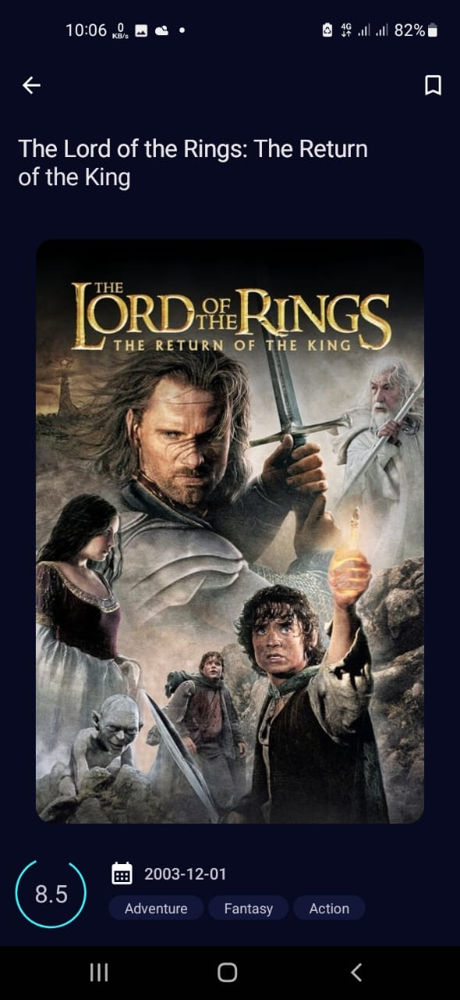
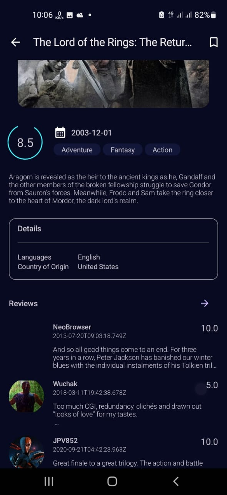
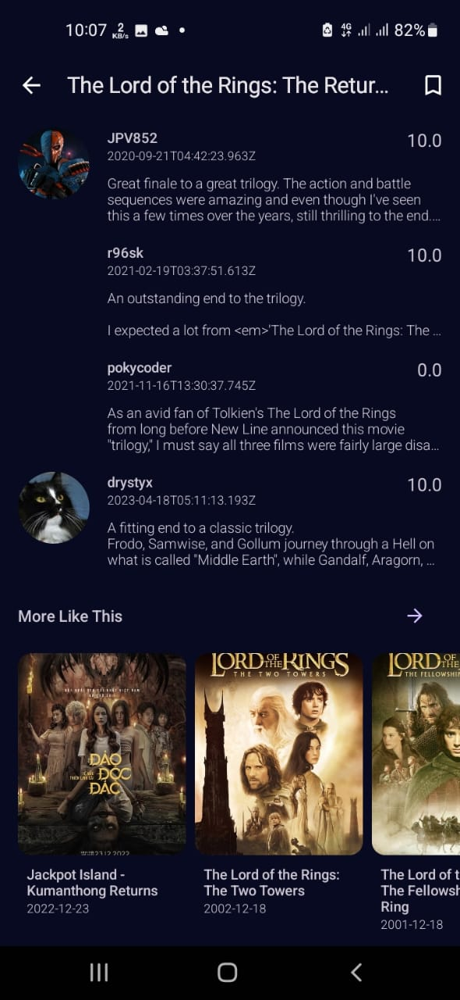
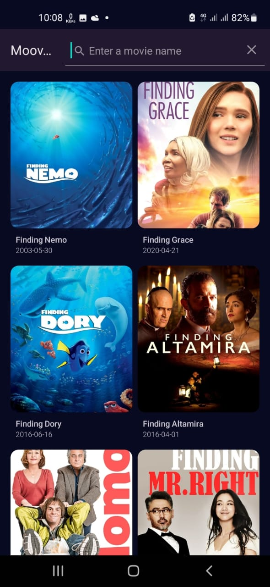

# Mooviku
### Project Description
**Mooviku** is a movie app that allows users to browse and discover movies using TheMovieDB API. This app is still under development and aims to provide a seamless experience for movie enthusiasts.

### Screenshots
| Image 1 | Image 2 | Image 3 | Image 4 | Image 5 |
|---------|---------|---------|---------|---------|
|  |  |  |  |  |
| Home screen | Movie detail screen, expanding top app bar containing the title and bookmark functionality | Movie detail screen, detailed information on the movie | Movie detail screen, reviews and movie recommendations | Search feature |

### Tools and Practices Used

- **Clean Architecture**
- **Reactive Programming** (Kotlin Flow)
- **StateFlow** instead of LiveData
- **Modularization** (core and main)
- **Dynamic Feature** (favorite feature)
- **Dagger2 / Hilt**
- **Retrofit**
- **Room**

#### Why?
To ensure the app's scalability and maintainability.

Clean Architecture:
- Promotes separation of concerns
- Allows for easier testing and maintenance
- Provides a clear and organized architecture for the app

Reactive Programming (Kotlin Flow):
- Enables the app to react to data changes efficiently
- Provides a more efficient and streamlined approach to handling asynchronous events

Modularization:
- The app is divided into Core and Main modules
- Provides a more organized and scalable approach to the app's development
- Allows for easy feature addition or removal

Dynamic Feature:
- A Dynamic Feature is being implemented for the favorite feature
- Provides a more efficient way to add features without affecting the app's overall performance

Dependency Injection:
- Dagger2 / Hilt is being used for dependency injection
- Provides a more organized and efficient way of handling dependencies

Networking:
- Retrofit is being used for network requests
- Provides a more efficient and streamlined approach to handling network requests

Local Storage:
- Room is being used for local data storage
- Provides a more efficient and streamlined approach to handling local data storage

### What's Currently Being Developed
- The implementation of Continuous Integration using Circle CI.

### What Will be Developed Ahead
- Paging
- Animations
- Jetpack Compose migration
